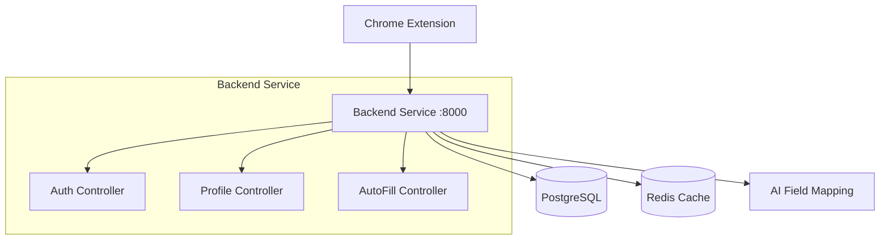

# 🚀 AutoFill Copilot

<div align="center">
  
  
  
  
  
</div>

<div align="center">
  <h3>🧠 Intelligent Form Auto-Filling with AI-Powered Analysis</h3>
  <p>AutoFill Copilot revolutionizes form filling by intelligently analyzing web forms and automatically populating them with your profile data. Save time, reduce errors, and streamline your online experience.</p>
</div>

## 🏗️ Architecture Overview

**Simplified Monolithic Architecture** - Consolidated from microservices for easier deployment and maintenance.

```
├── extension/         # Chrome browser extension for form detection and auto-filling
├── backend-service/   # Consolidated Laravel API (auth, profiles, autofill, AI)
├── docker-compose.yml # Container orchestration for all services
├── start.sh           # Quick startup script
└── README.md          # This documentation
```

## 📦 Components

### 🔌 Browser Extension

Chrome extension that provides:

-   🕵️ **Smart Form Detection**: Automatically detects and analyzes form fields
-   🤖 **Intelligent Auto-Fill**: Uses AI to match profile data to form fields
-   🔒 **Secure Communication**: Encrypted communication with backend API
-   ⚡ **Real-time Processing**: Instant form filling with user confirmation

### � Backend Service (Laravel 11)

Consolidated API service providing:

-   🔐 **Authentication**: JWT-based auth with Laravel Sanctum
-   👤 **Profile Management**: User profiles with secure data storage
-   🧠 **AI-Powered Mapping**: Intelligent field matching algorithms
-   📊 **Form Analytics**: Learning from user patterns and preferences
-   �️ **Security**: Rate limiting, validation, and data encryption

### 🗄️ Database Layer

-   **PostgreSQL**: Primary database for user data and profiles
-   **Redis**: Caching layer for improved performance
-   **Migrations**: Version-controlled database schema management

## 🌟 Key Features

-   **RabbitMQ**: Message queue for async processing
-   **MinIO**: S3-compatible object storage for documents
-   **Redis**: Caching and session management

## 📋 Prerequisites

-   🐳 **Docker & Docker Compose** - For containerized deployment
-   🌐 **Google Chrome** - For extension installation and testing
-   💻 **Git** - For repository management

## ⚡ Quick Start

### 1️⃣ **Clone & Start Backend**

```bash
git clone <repository-url>
cd AutoFill-Copilot

# Start all services with one command
./start.sh
```

### 2️⃣ **Install Browser Extension**

# Open Chrome Extensions

1. Go to chrome://extensions/
2. Enable "Developer mode" (top-right toggle)
3. Click "Load unpacked"
4. Select the "extension" folder from this project

````

### 3️⃣ **Test the System**

```bash
# Check backend health
curl http://localhost:8000/api/health

# Register a test user
curl -X POST http://localhost:8000/api/register \
  -H "Content-Type: application/json" \
  -d '{"name":"Test User","email":"test@example.com","password":"password123"}'

# Visit any website with forms and test auto-fill!
````

## 🔧 Service Access

| Service             | URL                              | Description            |
| ------------------- | -------------------------------- | ---------------------- |
| 🚀 **Backend API**  | http://localhost:8000            | Main API endpoint      |
| 💚 **Health Check** | http://localhost:8000/api/health | Service status         |
| 🐘 **PostgreSQL**   | localhost:5432                   | Database (autofill_db) |
| 🔴 **Redis**        | localhost:6379                   | Cache layer            |

## 🛠️ Development Commands

```bash
# View logs
docker-compose logs -f

# Restart backend only
docker-compose restart backend-service

# Stop all services
docker-compose down

# Rebuild and restart
docker-compose up -d --build
```

### Consolidated API (Port 8000)

| Method             | Endpoint        | Description                |
| ------------------ | --------------- | -------------------------- |
| **Authentication** |
| `POST`             | `/api/register` | Register new user          |
| `POST`             | `/api/login`    | User login                 |
| `POST`             | `/api/logout`   | User logout                |
| **Profiles**       |
| `GET`              | `/api/profile`  | Get user profile           |
| `PUT`              | `/api/profile`  | Update user profile        |
| **AutoFill**       |
| `POST`             | `/api/autofill` | Get form field suggestions |
| **Health**         |
| `GET`              | `/api/health`   | Service health check       |

## 🏗️ System Architecture



## 🔐 Security Features

-   🔑 **JWT Authentication** with Laravel Sanctum
-   🛡️ **Input Validation** and sanitization
-   🚀 **Rate Limiting** for API protection
-   🔒 **Encrypted Storage** for sensitive data
-   🚫 **CORS Protection** for browser security
-   Encrypted data storage

## Monitoring and Logging

-   Centralized logging with structured logs
-   Health check endpoints for each service
-   Redis for caching and session management
-   Database connection pooling

## Deployment

### Production Deployment

1. Update environment variables for production
2. Configure SSL certificates
3. Set up proper database backups
4. Configure monitoring and alerting

### Scaling

Services can be scaled independently:

```bash
docker-compose up --scale ai-service=3 --scale doc-parser=2
```

## Contributing

1. Fork the repository
2. Create a feature branch
3. Make your changes
4. Add tests if applicable
5. Submit a pull request

## License

[Your License Here]

## Support

For support and questions:

-   Create an issue in this repository
-   Contact the development team
-   Check the documentation in each service directory

---

**Note**: This is a development setup. For production deployment, additional security measures, monitoring, and configuration adjustments are required.
