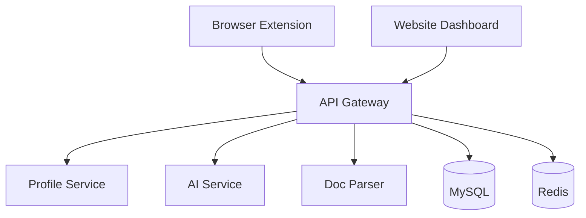

# AutoFill Copilot

A comprehensive microservices-based application for intelligent form auto-filling with AI-powered document parsing and multi-tenant profile management.

## Architecture Overview

```
├── extension/         # Browser extension for form detection and auto-filling
├── api-gateway/       # Laravel API gateway (routes and coordinates requests)
├── profile-service/   # Laravel service (multi-tenancy, secure vault management)
├── auth-service/      # Centralized authentication and authorization service
├── ai-service/        # AI/NLP microservice for intelligent field mapping
├── doc-parser/        # OCR/AI document extraction service
├── website/           # Laravel + Livewire + Tailwind dashboard
├── monitoring/        # Prometheus, Grafana configurations
├── docker-compose.yml # Container orchestration
└── README.md          # This file
```

## Services Description

### 🔌 Extension

Browser extension that:

-   Detects form fields on web pages
-   Communicates with the API gateway
-   Auto-fills forms based on user profiles
-   Provides seamless user experience

### 🚪 API Gateway

Laravel-based central API that:

-   Routes requests between services
-   Handles authentication and authorization
-   Manages API rate limiting
-   Provides unified API endpoints

### 👤 Profile Service

Multi-tenant Laravel service that:

-   Manages user profiles and organizations
-   Provides secure data vault functionality
-   Handles multi-tenancy architecture
-   Manages user permissions and access control

### 🤖 AI Service

Python/Node.js AI microservice that:

-   Performs intelligent field mapping
-   Uses NLP for form field understanding
-   Provides AI-powered suggestions
-   Learns from user patterns

### 📄 Doc Parser

OCR and document processing service that:

-   Extracts data from uploaded documents
-   Performs OCR on images and PDFs
-   Uses AI for intelligent data extraction
-   Supports multiple document formats

### 🔐 Auth Service

Centralized authentication service that:

-   Manages JWT tokens and OAuth flows
-   Provides single sign-on (SSO) capabilities
-   Handles user authentication and authorization
-   Integrates with external identity providers

### 🌐 Website

Laravel + Livewire dashboard that:

-   Provides web-based management interface
-   Uses Tailwind CSS for modern UI
-   Offers real-time updates with Livewire
-   Manages profiles and settings

## Infrastructure Services

### 📊 Monitoring Stack

-   **Prometheus**: Metrics collection and alerting
-   **Grafana**: Visualization dashboards and analytics
-   **Jaeger**: Distributed tracing for microservices
-   **Elasticsearch + Kibana**: Centralized logging and search

### 🚀 Supporting Services

-   **RabbitMQ**: Message queue for async processing
-   **MinIO**: S3-compatible object storage for documents
-   **Redis**: Caching and session management
-   **MySQL**: Primary database for all services

## Prerequisites

-   Docker and Docker Compose
-   Git
-   Node.js (for extension development)
-   PHP 8.1+ (for local Laravel development)

## Quick Start

1. **Clone the repository**

    ```bash
    git clone <repository-url>
    cd AutoFill-Copilot
    ```

2. **Start all services**

    ```bash
    docker-compose up -d
    ```

3. **Access services**

**Core Application Services:**

-   API Gateway: http://localhost:8000
-   Profile Service: http://localhost:8001
-   AI Service: http://localhost:8002
-   Document Parser: http://localhost:8003
-   Auth Service: http://localhost:8004
-   Website Dashboard: http://localhost:8080

**Infrastructure & Monitoring:**

-   Grafana Dashboard: http://localhost:3000 (admin/admin123)
-   Prometheus Metrics: http://localhost:9090
-   Jaeger Tracing: http://localhost:16686
-   Kibana Logs: http://localhost:5601
-   RabbitMQ Management: http://localhost:15672 (admin/password)
-   MinIO Console: http://localhost:9011 (minioadmin/minioadmin123)
-   MinIO API: http://localhost:9010

**Databases:**

-   MySQL: localhost:3306
-   Redis: localhost:6379
-   Elasticsearch: localhost:9200

## Development Setup

### Environment Configuration

Each service requires its own environment configuration:

1. **API Gateway** (`api-gateway/.env`)
2. **Profile Service** (`profile-service/.env`)
3. **Website** (`website/.env`)

### Database Setup

The system uses multiple databases:

-   `autofill_gateway` - API Gateway data
-   `autofill_profiles` - Profile Service data
-   `autofill_website` - Website dashboard data

### Extension Development

1. Navigate to the `extension/` directory
2. Load the extension in Chrome Developer Mode
3. Point to the `extension/` folder

## Service Communication



## API Endpoints

### API Gateway (Port 8000)

-   `GET /api/profiles` - Get user profiles
-   `POST /api/autofill` - Request form auto-fill
-   `POST /api/documents/parse` - Parse uploaded documents

### Profile Service (Port 8001)

-   `GET /api/profiles/{id}` - Get specific profile
-   `POST /api/profiles` - Create new profile
-   `PUT /api/profiles/{id}` - Update profile

### AI Service (Port 8002)

-   `POST /api/analyze` - Analyze form fields
-   `POST /api/suggestions` - Get field suggestions

### Doc Parser (Port 8003)

-   `POST /api/extract` - Extract data from documents
-   `GET /api/formats` - Supported document formats

## Security Features

-   Multi-tenant architecture with data isolation
-   Secure vault for sensitive information
-   JWT-based authentication
-   Rate limiting and API protection
-   Encrypted data storage

## Monitoring and Logging

-   Centralized logging with structured logs
-   Health check endpoints for each service
-   Redis for caching and session management
-   Database connection pooling

## Deployment

### Production Deployment

1. Update environment variables for production
2. Configure SSL certificates
3. Set up proper database backups
4. Configure monitoring and alerting

### Scaling

Services can be scaled independently:

```bash
docker-compose up --scale ai-service=3 --scale doc-parser=2
```

## Contributing

1. Fork the repository
2. Create a feature branch
3. Make your changes
4. Add tests if applicable
5. Submit a pull request

## License

[Your License Here]

## Support

For support and questions:

-   Create an issue in this repository
-   Contact the development team
-   Check the documentation in each service directory

---

**Note**: This is a development setup. For production deployment, additional security measures, monitoring, and configuration adjustments are required.
