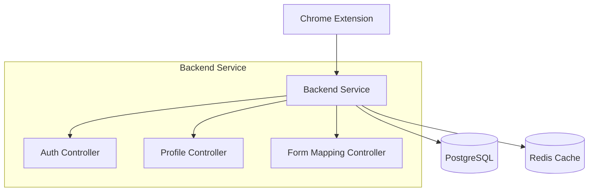

# 🚀 AutoFill Copilot

<div align="center">
  
  
  
  
  
</div>

<div align="center">
  <h3>🧠 Intelligent Form Auto-Filling with Pattern Matching</h3>
  <p>AutoFill Copilot intelligently analyzes web forms and automatically populates them with your profile data using smart field detection. Save time, reduce errors, and streamline your online experience.</p>
</div></div>

## 🏗️ Architecture Overview

**Multi-Service Architecture** - Modular design for scalable development and deployment.

```
├── extension/           # Chrome Manifest V3 extension
│   ├── manifest.json   # Extension configuration
│   ├── background.js   # Service worker for API communication
│   ├── popup.html/js   # Extension popup interface
│   ├── options.html/js # Settings and profile management
│   └── content/        # Content scripts for form interaction
├── backend-service/     # Laravel 11 API backend
│   ├── app/            # Controllers, models, services
│   ├── database/       # Migrations and seeders
│   ├── routes/         # API endpoints
│   └── docker/         # Docker configuration
├── db/                 # PostgreSQL database container
├── redis/              # Redis cache container
├── docker-compose.yml  # Container orchestration
└── README.md           # Project documentation
```

## 📦 Components

### 🔌 Chrome Extension (Manifest V3)

Browser extension that provides:

-   🕵️ **Smart Form Detection**: Automatically detects form fields on any website
-   🎯 **Pattern-Based Matching**: Matches form fields to user data using intelligent patterns
-   🔒 **Secure Communication**: JWT-authenticated API communication
-   ⚡ **Instant Fill**: Real-time form population with user confirmation
-   📊 **Form Counting**: Tracks detected forms across websites
-   ⚙️ **User-Friendly UI**: Clean popup interface and options page

### 🚀 Backend Service (Laravel 12)

RESTful API service providing:

-   🔐 **Authentication**: JWT tokens with Laravel Sanctum
-   👤 **Profile Management**: JSON-based user profile storage
    -- (AutoFill engine removed in this branch)
-   🛡️ **Security**: Input validation, rate limiting, and secure data handling

### 🗄️ Infrastructure

-   **PostgreSQL**: Primary database for users, profiles, and form mappings
-   **Redis**: Caching and session management
-   **Docker**: Containerized deployment with docker-compose
-   **Nginx**: Web server and reverse proxy

## 🌟 Key Features

-   ✨ **Intelligent Field Detection**: Recognizes name, email, address, phone fields automatically
-   🎯 **Domain Learning**: Remembers form mappings for each website
-   🔄 **Multiple Profiles**: Support for personal, business, and custom profiles
-   📱 **Cross-Form Support**: Works with any HTML form on any website
-   🎨 **Clean UI**: Intuitive popup and options interface
-   🔒 **Privacy First**: Local profile storage with secure API communication

## 📋 Prerequisites

-   🐳 **Docker & Docker Compose** - For containerized deployment
-   🌐 **Google Chrome** - For extension installation and testing
-   💻 **Git** - For repository management

## ⚡ Quick Start

### 1️⃣ **Clone & Start Backend**

```bash
git clone <repository-url>
cd AutoFill-Copilot

# Start all services
docker-compose up -d

# Check services are running
docker-compose ps
```

### 2️⃣ **Install Chrome Extension**

1. Open Chrome and go to `chrome://extensions/`
2. Enable **Developer mode** (toggle in top-right)
3. Click **"Load unpacked"**
4. Select the `extension` folder from this project
5. Extension should appear in your toolbar

### 3️⃣ **Setup and Test**

````bash
# Check backend health
curl https://localhost/api/health

# Register a test user via API
curl -X POST https://localhost/api/auth/register \
  -H "Content-Type: application/json" \
  -d '{"name":"Test User","email":"test@example.com","password":"password123","password_confirmation":"password123"}'
```bash
# Check backend health
curl https://localhost/api/health

# Register a test user via API
curl -X POST https://localhost/api/auth/register \
  -H "Content-Type: application/json" \
  -d '{"name":"Test User","email":"test@example.com","password":"password123","password_confirmation":"password123"}'
````

## 🔧 Service Access

| Service             | URL                          | Description                 |
| ------------------- | ---------------------------- | --------------------------- |
| 🚀 **Backend API**  | https://localhost            | Main API endpoint           |
| 💚 **Health Check** | https://localhost/api/health | Service status              |
| 🐘 **PostgreSQL**   | localhost:5432               | Database (autofill_backend) |
| 🔴 **Redis**        | localhost:6379               | Cache layer                 |

## 🛠️ Development Commands

```bash
# View logs
docker-compose logs -f

# Restart backend only
docker-compose restart backend-service

# Stop all services
docker-compose down

# Rebuild and restart
docker-compose up -d --build
```

## 📡 API Documentation

### Authentication Endpoints

| Method | Endpoint             | Description            |
| ------ | -------------------- | ---------------------- |
| `POST` | `/api/auth/register` | Register new user      |
| `POST` | `/api/auth/login`    | User login             |
| `POST` | `/api/auth/logout`   | User logout            |
| `GET`  | `/api/auth/profile`  | Get authenticated user |

### Profile Management

| Method   | Endpoint                          | Description         |
| -------- | --------------------------------- | ------------------- |
| `GET`    | `/api/user-profiles`              | List user profiles  |
| `POST`   | `/api/user-profiles`              | Create new profile  |
| `PUT`    | `/api/user-profiles/{id}`         | Update profile      |
| `DELETE` | `/api/user-profiles/{id}`         | Delete profile      |
| `GET`    | `/api/users/{id}/default-profile` | Get default profile |

### AutoFill Engine

The AutoFill engine has been removed from this branch. Endpoints related to in-page form analysis are deprecated.

### Form Mappings

| Method | Endpoint | Description |
| ------ | -------- | ----------- |

<!-- Form mapping endpoints removed -->

### System

| Method | Endpoint      | Description             |
| ------ | ------------- | ----------------------- |
| `GET`  | `/api/health` | Service health check    |
| `GET`  | `/api/test`   | Basic connectivity test |

## 🏗️ System Architecture



## 🔐 Security Features

-   🔑 **JWT Authentication** with Laravel Sanctum
-   🛡️ **Input Validation** and sanitization
-   🚀 **Rate Limiting** for API protection
-   🔒 **Encrypted Storage** for sensitive data
-   🚫 **CORS Protection** for browser security
-   Encrypted data storage

## 📊 Monitoring and Logging

-   **Structured Logs**: Laravel logging with daily rotation
-   **Health Endpoints**: `/api/health` and `/api/test` for monitoring
-   **Redis Caching**: Session management and API response caching
-   **Database**: PostgreSQL with connection pooling
-   **Error Tracking**: Laravel error handling and logging

## 🛠️ Technology Stack

### Backend

-   **Laravel 11** - PHP framework
-   **PHP 8.4** - Programming language
-   **PostgreSQL 15** - Primary database
-   **Redis 7** - Caching and sessions
-   **Laravel Sanctum** - JWT authentication
-   **Docker** - Containerization

### Frontend (Extension)

-   **Chrome Manifest V3** - Extension framework
-   **Vanilla JavaScript** - No framework dependencies
-   **HTML/CSS** - UI components
-   **Chrome APIs** - Extension functionality

### Development

-   **Docker Compose** - Local development
-   **Nginx** - Web server
-   **Composer** - PHP dependency management

## 🚀 Deployment

### Production Deployment

1. Update environment variables for production
2. Configure SSL certificates
3. Set up proper database backups
4. Configure monitoring and alerting

### Scaling

The backend service can be scaled:

```bash
# Scale backend service (requires load balancer setup)
docker-compose up --scale backend-service=2

# Note: Scaling requires additional configuration for load balancing
```

## Contributing

1. Fork the repository
2. Create a feature branch
3. Make your changes
4. Add tests if applicable
5. Submit a pull request

## 📄 License

This project is open source and available under the [MIT License](LICENSE).

## Support

For support and questions:

-   Create an issue in this repository
-   Contact the development team
-   Check the documentation in each service directory

---

**Note**: This is a development setup. For production deployment, additional security measures, monitoring, and configuration adjustments are required.
