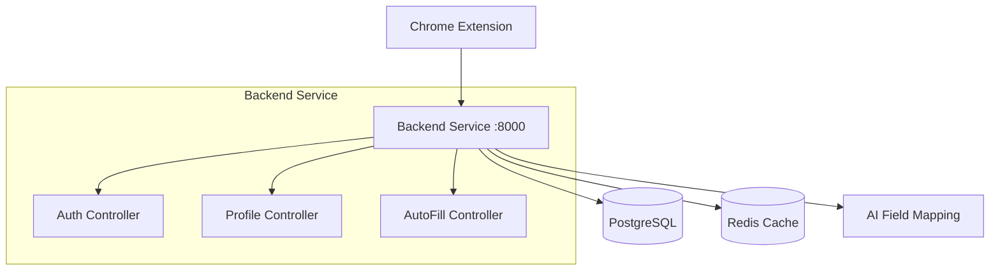

# 🚀 AutoFill Copilot

<div align="center">
  
  
  
  
  
</div>

<div align="center">
  <h3>🧠 Intelligent Form Auto-Filling with Pattern Matching</h3>
  <p>AutoFill Copilot intelligently analyzes web forms and automatically populates them with your profile data using smart field detection. Save time, reduce errors, and streamline your online experience.</p>
</div></div>

## 🏗️ Architecture Overview

**Monolithic Architecture** - Simple, consolidated design for easy development and deployment.

```
├── extension/           # Chrome Manifest V3 extension
│   ├── manifest.json   # Extension configuration
│   ├── background.js   # Service worker for API communication
│   ├── popup.html/js   # Extension popup interface
│   ├── options.html/js # Settings and profile management
│   └── content/        # Content scripts for form interaction
├── backend-service/     # Laravel 11 API backend
│   ├── app/            # Controllers, models, services
│   ├── database/       # Migrations and seeders
│   ├── routes/         # API endpoints
│   └── docker/         # Docker configuration
├── docker-compose.yml  # Container orchestration
└── README.md          # Project documentation
```

## 📦 Components

### 🔌 Chrome Extension (Manifest V3)

Browser extension that provides:

-   🕵️ **Smart Form Detection**: Automatically detects form fields on any website
-   🎯 **Pattern-Based Matching**: Matches form fields to user data using intelligent patterns
-   🔒 **Secure Communication**: JWT-authenticated API communication
-   ⚡ **Instant Fill**: Real-time form population with user confirmation
-   📊 **Form Counting**: Tracks detected forms across websites
-   ⚙️ **User-Friendly UI**: Clean popup interface and options page

### 🚀 Backend Service (Laravel 11)

RESTful API service providing:

-   🔐 **Authentication**: JWT tokens with Laravel Sanctum
-   👤 **Profile Management**: JSON-based user profile storage
-   🎯 **AutoFill Engine**: Intelligent field mapping and form analysis
-   � **Form Mapping**: Domain-specific form learning and optimization
-   🛡️ **Security**: Input validation, rate limiting, and secure data handling

### 🗄️ Infrastructure

-   **PostgreSQL**: Primary database for users, profiles, and form mappings
-   **Redis**: Caching and session management
-   **Docker**: Containerized deployment with docker-compose
-   **Nginx**: Web server and reverse proxy

## 🌟 Key Features

-   ✨ **Intelligent Field Detection**: Recognizes name, email, address, phone fields automatically
-   🎯 **Domain Learning**: Remembers form mappings for each website
-   🔄 **Multiple Profiles**: Support for personal, business, and custom profiles  
-   📱 **Cross-Form Support**: Works with any HTML form on any website
-   🎨 **Clean UI**: Intuitive popup and options interface
-   🔒 **Privacy First**: Local profile storage with secure API communication

## 📋 Prerequisites

-   🐳 **Docker & Docker Compose** - For containerized deployment
-   🌐 **Google Chrome** - For extension installation and testing
-   💻 **Git** - For repository management

## ⚡ Quick Start

### 1️⃣ **Clone & Start Backend**

```bash
git clone <repository-url>
cd AutoFill-Copilot

# Start all services
docker-compose up -d

# Check services are running
docker-compose ps
```

### 2️⃣ **Install Chrome Extension**

1. Open Chrome and go to `chrome://extensions/`
2. Enable **Developer mode** (toggle in top-right)
3. Click **"Load unpacked"**
4. Select the `extension` folder from this project
5. Extension should appear in your toolbar

````

### 3️⃣ **Setup and Test**

```bash
# Check backend health
curl http://localhost:8000/api/health

# Register a test user via API
curl -X POST http://localhost:8000/api/auth/register \
  -H "Content-Type: application/json" \
  -d '{"name":"Test User","email":"test@example.com","password":"password123","password_confirmation":"password123"}'
```

**Using the Extension:**
1. Click the AutoFill Copilot icon in Chrome toolbar
2. Login with your registered credentials
3. Go to Options to create your autofill profile
4. Visit any website with forms
5. Click "Fill Current Form" to test!`

## 🔧 Service Access

| Service             | URL                              | Description            |
| ------------------- | -------------------------------- | ---------------------- |
| 🚀 **Backend API**  | http://localhost:8000            | Main API endpoint      |
| 💚 **Health Check** | http://localhost:8000/api/health | Service status         |
| 🐘 **PostgreSQL**   | localhost:5432                   | Database (autofill_db) |
| 🔴 **Redis**        | localhost:6379                   | Cache layer            |

## 🛠️ Development Commands

```bash
# View logs
docker-compose logs -f

# Restart backend only
docker-compose restart backend-service

# Stop all services
docker-compose down

# Rebuild and restart
docker-compose up -d --build
```

## 📡 API Documentation

### Authentication Endpoints
| Method | Endpoint | Description |
|--------|----------|-------------|
| `POST` | `/api/auth/register` | Register new user |
| `POST` | `/api/auth/login` | User login |
| `POST` | `/api/auth/logout` | User logout |
| `GET` | `/api/auth/profile` | Get authenticated user |

### Profile Management  
| Method | Endpoint | Description |
|--------|----------|-------------|
| `GET` | `/api/user-profiles` | List user profiles |
| `POST` | `/api/user-profiles` | Create new profile |
| `PUT` | `/api/user-profiles/{id}` | Update profile |
| `DELETE` | `/api/user-profiles/{id}` | Delete profile |
| `GET` | `/api/users/{id}/default-profile` | Get default profile |

### AutoFill Engine
| Method | Endpoint | Description |
|--------|----------|-------------|
| `POST` | `/api/autofill` | Analyze form and get fill suggestions |
| `POST` | `/api/autofill/analyze` | Analyze form without filling |

### Form Mappings
| Method | Endpoint | Description |
|--------|----------|-------------|
| `GET` | `/api/form-mappings` | List user's form mappings |
| `GET` | `/api/form-mappings/by-domain` | Get mappings by domain |
| `POST` | `/api/form-mappings/{id}/track-usage` | Track mapping usage |

### System
| Method | Endpoint | Description |
|--------|----------|-------------|
| `GET` | `/api/health` | Service health check |
| `GET` | `/api/test` | Basic connectivity test |

## 🏗️ System Architecture



## 🔐 Security Features

-   🔑 **JWT Authentication** with Laravel Sanctum
-   🛡️ **Input Validation** and sanitization
-   🚀 **Rate Limiting** for API protection
-   🔒 **Encrypted Storage** for sensitive data
-   🚫 **CORS Protection** for browser security
-   Encrypted data storage

## Monitoring and Logging

-   Centralized logging with structured logs
-   Health check endpoints for each service
-   Redis for caching and session management
-   Database connection pooling

## Deployment

### Production Deployment

1. Update environment variables for production
2. Configure SSL certificates
3. Set up proper database backups
4. Configure monitoring and alerting

### Scaling

Services can be scaled independently:

```bash
docker-compose up --scale ai-service=3 --scale doc-parser=2
```

## Contributing

1. Fork the repository
2. Create a feature branch
3. Make your changes
4. Add tests if applicable
5. Submit a pull request

## License

[Your License Here]

## Support

For support and questions:

-   Create an issue in this repository
-   Contact the development team
-   Check the documentation in each service directory

---

**Note**: This is a development setup. For production deployment, additional security measures, monitoring, and configuration adjustments are required.
